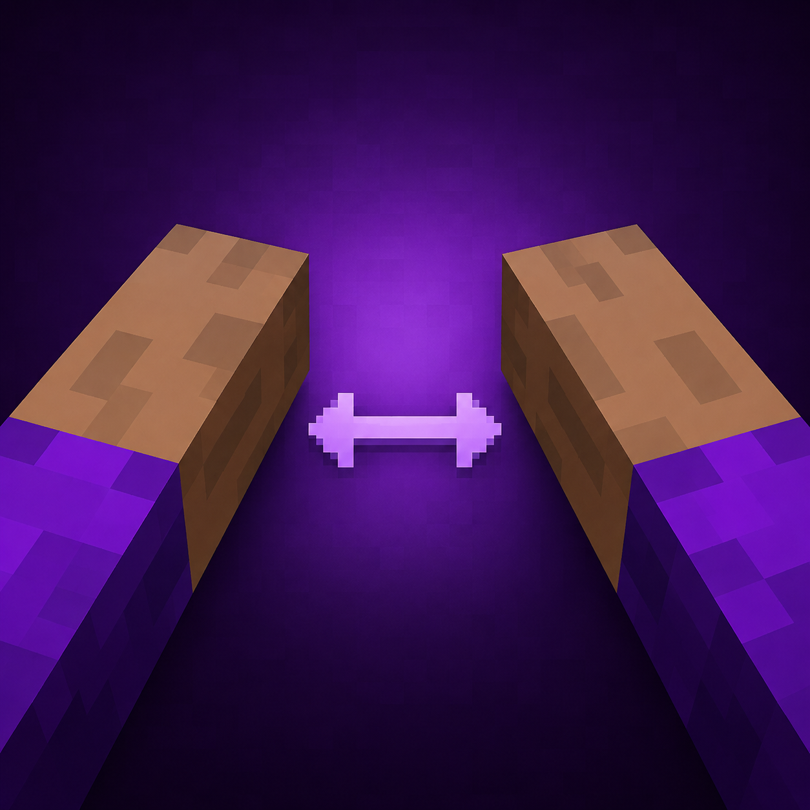

# KoHs Hands Position

[](https://github.com/kerlycanelita/KoHs-Hands-Position)
[](https://github.com/kerlycanelita/KoHs-Hands-Position/issues)
[](https://discord.gg/9t2VxEF7UU)

<p align="center">
  
</p>

**First-person hand size and spacing, adjusted against a live preview of your own
skin and the items you are actually holding.**

Client-side Fabric mod for Minecraft Java **26.1.2**, by **Zymekoh**.

## What it changes

The normal screen has two global settings and optional per-hand overrides:

- **Hand size — 50 % to 150 %.** Starts at 100 %.
- **Hand spacing — −40 % to +40 %.** Negative values bring the hands closer
  together, positive values push them apart. Starts at 0 %. It is a relative
  visual offset, not an absolute position.

Each section also exposes **Main hand** and **Offhand** sliders. Editing either
one automatically enables that section's independent values and fades the
global slider. **Use global** restores the global slider for that section only;
size and spacing overrides are independent of each other.

**Move hands** hides the settings and HUD to expose the background and hands.
Hold the left mouse button on either visible hand or held item and drag it. The
hand under the cursor is selected in the same front-to-back order shown on
screen, with a move cursor and a label identifying the selected hand. **Reset**
clears both dragged positions while preserving size and
spacing; **Done** returns to the regular controls.

Both affect the first-person presentation of the hands and the items they hold.

## What it does not change

Gameplay animations still run through Minecraft's own renderer. Nothing here
touches interactions, reach, timing, packets or the items themselves — only how
the hands are drawn in first person.

## The preview

The configuration screen renders your real skin and your real equipment above a
translucent purple background, with no blur.

- The offhand appears in the preview only when it holds an item.
- The controls fall into two cards on wide screens and two tabs on compact
  logical screens, so high GUI scales keep every slider and footer button
  inside the window.
- Dark cards, visible slider handles and separate accents for the main hand,
  offhand and global controls make the settings easy to distinguish. Inactive
  global sliders are dimmed and explicitly labeled; actions have contrasting
  borders, hover feedback and keyboard focus indicators.
- The screen pauses singleplayer worlds while the hands are being adjusted.
- Maps are shown one-handed in the preview when the offhand is empty; in play
  they keep their usual animation.

The preview uses a rest pose and uniform lighting, which is what makes small
adjustments readable.

Changes appear in the preview immediately and are used in first person during
play. They are saved when the screen is closed with **Done** or **Esc**, to
`config/kohs_hands_position.json`.

Opening the configuration from the main menu works and the values can be
adjusted, but a world has to be joined to see the hands themselves.

## Install

1. Install [Fabric Loader](https://fabricmc.net/use/) 0.19.3 or newer and use
   Java 25.
2. Install Fabric API for 26.1.2.
3. Put `kohs-hands-position-1.1.1+mc26.1.2.jar` in the `mods` folder, replacing
   the previous version of this mod.
4. Install Mod Menu 18 to reach the configuration screen.

Then open **Mods → KoHs Hands Position → Configure** from inside a world.

## Building

With JDK 25 and `JAVA_HOME` pointing at it:

```powershell
.\gradlew.bat build
```

The installable output is `build/libs/kohs-hands-position-1.1.1+mc26.1.2.jar`.
The file ending in `-sources.jar` contains the source code and is not the
playable build.

The build runs the config, interaction, layout and texture-readback regression tests.
See the [development notes](docs/DEVELOPMENT.md) for their scope and the remaining in-game checks.

## Repository layout

| Location | Contents |
| --- | --- |
| `src/client/` | Configuration, GUI, hand rendering and client Mixins. |
| `src/main/resources/` | Mod metadata, icon and Mixin registration. |
| `src/test/` | Config, interaction and texture-readback tests. |
| `docs/` | Development notes and repository navigation. |
| `gradle/` | Gradle Wrapper configuration. |

Start with the [documentation index](docs/README.md). Build output and local
Minecraft instances remain outside Git; keep installable JARs out of the source tree.

## License

All rights reserved. See [LICENSE](LICENSE).

## Credits

Made by **zymekoh**.
